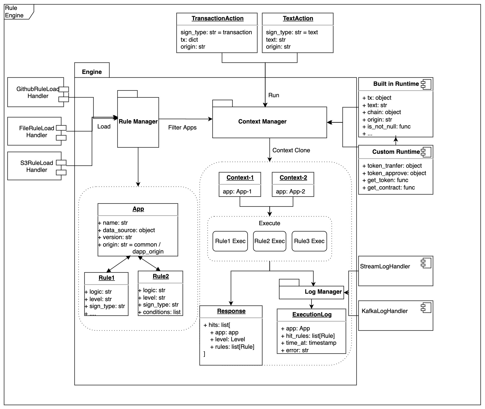

# Security Rule Engine Core

## Introduction

The web3-security-engine loads the security rules defined in [Web3DAppSecurityProtocol](https://github.com/RabbyHub/Web3DAppSecurityProtocol) to perform risk detection.

## Requirements

Python >=3.7

## Installation & Usage

```
pip install web3-security-engine
```

Then import the package:

```
import security_engine
```

## Getting Started

### Custom your own runtime context

You need to implement the custom functions and properties used in the rules.

Example: [custom context](./examples/custom_runtime/context.py)

### Specify rule repository

```
repo_list = [
        {
            // repository url
            'url': 'https://github.com/RabbyHub/web3-security-rules',
            // We locate the version of the rule based on the commit hash
            'commit_hash': 'a72d4c8b669bf8493d772f5b4097e82db85c4318',
            // If it is a dapp specific rule set, then specify the page origin of the rules to be applied, otherwise, default is common.
            'origin': 'common',
        },
        {
            'url': 'https://github.com/RabbyHub/example-dapp-security-rule',
            'commit_hash': '928e2c8cb41864c81c2c65a69b000c3761c8306c',
            'origin': 'https://debank.com',
        }
    ]
```

### Load rule engine

```
engine = SecurityEngineCore()

rule_load_handler = GithubRepoRuleLoadHandler(repo_list, 'demo token')
engine.add_handler(rule_load_handler)

engine.load()
print('load successfuly.')

```

### Init runtime context

```
params = [
        {
            "transaction": {
                "chainId": 42161,
                "data": "0x",
                "from": "0x34799a3314758b976527f8489e522e835ed8d0d2",
                "gas": "0x5208",
                "gasPrice": "0x1dcd65000",
                "nonce": "0x0",
                "to": "0x5853ed4f26a3fcea565b3fbc698bb19cdf6deb85",
                "value": "0x5efe7ec8b12d9c8"
            },
            "origin": "https://debank.com/"
        }
    ]

action = get_action(param)
context = get_context(action)

```

### Run

```
result = engine.run(context)
print('hits=%s' % result.hits)
```

## Full Examples

```python
from security_engine.engine import SecurityEngineCore
from examples.custom_runtime.context import get_context
from security_engine.handlers.rule.rule_load_handler import GithubRepoRuleLoadHandler
from security_engine.handlers.log.log_handler import StreamLogHandler
from security_engine.models.action import get_action

def main():

    repo_list = [
            {
                'url': 'https://github.com/RabbyHub/web3-security-rules',
                'commit_hash': 'a72d4c8b669bf8493d772f5b4097e82db85c4318',
                'origin': 'common',
            },
            {
                'url': 'https://github.com/RabbyHub/example-dapp-security-rule',
                'commit_hash': '928e2c8cb41864c81c2c65a69b000c3761c8306c',
                'origin': 'http://debank.com',
            },
            {
                'url': 'https://github.com/RabbyHub/example-common-security-rule',
                'commit_hash': '999a5b2e175c0e2612b45b0e5abaebfb840eb63e',
                'origin': 'common',
            },
        ]

    engine = SecurityEngineCore()
    rule_load_handler = GithubRepoRuleLoadHandler(repo_list, 'demo token')
    engine.add_handler(rule_load_handler)

    # Add default log handler
    log_handler = StreamLogHandler()
    engine.add_handler(log_handler)

    engine.load()
    print('load successfuly.')


    params = [
        {
            "transaction": {
                "chainId": 42161,
                "data": "0x",
                "from": "0x34799a3314758b976527f8489e522e835ed8d0d2",
                "gas": "0x5208",
                "gasPrice": "0x1dcd65000",
                "nonce": "0x0",
                "to": "0x5853ed4f26a3fcea565b3fbc698bb19cdf6deb85",
                "value": "0x5efe7ec8b12d9c8"
            },
            "origin": "https://debank.com/"
        },
        {
            "text": '''Please sign to let us verify that you are the owner of this address 0x133ad1b948badb72ea0cfbb5a724b5b77c9b6311.
[2022-07-20 06:15:02]''',
            "chain_id": 1,
            "origin": "https://debank.com/"
        },
        {
            "text": '''Spam text signature''',
            "chain_id": 1,
            "origin": "https://debank.com/"
        }
    ]

    for param in params:
        action = get_action(param)
        if not action:
            print('invalid param')
            return
        context = get_context(action)
        result = engine.run(context)

        print('hits=%s' % result.hits)
        print('.................')

if __name__ == '__main__':
    main()


```

## Custom handler

### RuleLoadHandler

Inherit from [BaseRuleLoadHandler](./security_engine/handlers/rule/rule_load_handler.py)

```Python
class BaseRuleLoadHandler(BaseHandler):

    def fetch_raw(self):
        raise NotImplemented

    def load(self):
        raise NotImplemented
```

### LogHandler

Inherit from [BaseLogHandler](./security_engine/handlers/log/log_handler.py)

```python
class BaseLogHandler(BaseHandler):

    def add_trace_log(self):
        raise NotImplemented

    def output(self):
        raise NotImplemented
```

### Context

Inherit from [BaseContext](./security_engine/runtime/context.py)

```python
class Context(BaseContext):
    pass
```

## Module Diagram


